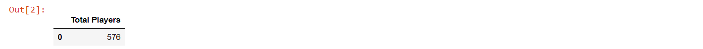
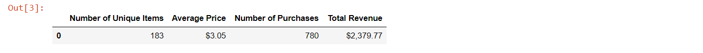

# Pandas Challenge (Analyzing Gaming Data with the Pandas Library in Jupyter Notebook)
-----


## Analysis

* Of the active players, the vast majority are male (84%). There also exists, a smaller, but notable proportion of female players (14%).
* Our peak age demographic falls between 20-24 (44.8%) with secondary groups falling between 15-19 (18.6%) and 25-29 (13.4%).
* The age group that spends the most money is the 20-24 age group.
-----


## Breakdown


#### Dependencies and Setup

```python
# Importing Pandas Library
import pandas as pd

# File to Load
file_path = "purchase_data.csv"

# Read Purchasing File and store into pandas data frame
raw_data = pd.read_csv(file_path)
raw_data.head()
```


#### Player Count

* total number of players

```python
# Calculate total number of players by finding unique screen names
total_players = len(raw_data["SN"].unique())

# Put into new data frame
total_players_df = pd.DataFrame({"Total Players": [total_players]})

# Print data frame
total_players_df
```




#### Purchasing Analysis

* number of unique items
* average purchase price
* total number of purchases
* total revenue

```python
# Calculate number of unique items in Item ID column
unique_items = len(raw_data["Item ID"].unique())

# Calculate the total revenue by summing the Price column
total_revenue = sum(raw_data["Price"])

# Calculate average price by diving the sum by the length of the Price column
avg_price = total_revenue/len(raw_data["Price"])

# Calculate number of purchases
num_of_purchases = len(raw_data["Purchase ID"])

# Put into new data frame
purchase_analysis_df = pd.DataFrame({"Number of Unique Items": [unique_items], "Average Price": [avg_price],
                              "Number of Purchases":[num_of_purchases], "Total Revenue":[total_revenue]})

# Format columns with money
purchase_analysis_df["Average Price"] = purchase_analysis_df["Average Price"].map("${:,.2f}".format)
purchase_analysis_df["Total Revenue"] = purchase_analysis_df["Total Revenue"].map("${:,.2f}".format)

# Output data frame
purchase_analysis_df
```




#### Percentage and Count by Gender

Third, I used .groupby(), 'bins', and .sort_values() to perform calculations on certain groups, such as:

* percentage and count of different genders and ages.
```python
```


#### Purchasing Analysis by Gender

* purchase count
* average purchase price
* total purchase value
* average purchase total per person by gender
```python
```


#### Purchasing Analysis by Age

* purchase count
* average purchase price
* total purchase value
* average purchase total per person by age group

#### Top Spenders

* top spenders by screen name

```python
```

#### Most Popular Items

* most popular items

```python
```

#### Most Profitable Items

* most profitable items

```python
```
-----


## Notes

When checking correctness in the final data frame (showing "most profitable items"), I realized that the values weren't sorted in descending values properly. After much research, I decided to delete the row that I felt was causing the main miscalculation while trying to show the first few rows with .head(). However, I want to keep researching to find another way to solve this without altering the data in a destructive way.