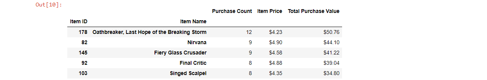

# Analyzing Gaming Data with the pandas Library in Jupyter Notebook


## Analysis

* The vast majority of players are male (84%). But the female players make up a notable proportion of 14%.
* Our peak age demographic falls between 20-24 (44.8%) with secondary groups falling between 15-19 (18.6%) and 25-29 (13.4%).
* The age group that spends the most money is the 20-24 age group.


## Breakdown


#### Dependencies and Setup

```python
# Importing pandas Library
import pandas as pd

# File to Load
file_path = "purchase_data.csv"

# Read Purchasing File and store into pandas data frame
raw_data = pd.read_csv(file_path)

# Output first rows of data frame
raw_data.head()
```


#### Player Count

* total number of players

```python
# Calculate player count (unique screen names)
total_players = len(raw_data["SN"].unique())

# Put into new data frame
total_players_df = pd.DataFrame({"Total Players": [total_players]})

# Output data frame
total_players_df
```


#### Purchase Summary

* number of unique items
* average purchase price
* total number of purchases
* total revenue

```python
# Calculate unique item count
unique_count = len(raw_data["Item ID"].unique())

# Calculate total and average purchase
total_purchase = sum(raw_data["Price"])
avg_purchase = total_purchase/len(raw_data["Price"])

# Calculate purchase count
purchase_count = len(raw_data["Purchase ID"])

# Put into new data frame
purchase_summary_df = pd.DataFrame({"Number of Unique Items": [unique_count], "Average Price": [avg_purchase],
                              "Number of Purchases":[purchase_count], "Total Revenue":[total_purchase]})

# Format prices
purchase_summary_df["Average Price"] = purchase_summary_df["Average Price"].map("${:,.2f}".format)
purchase_summary_df["Total Revenue"] = purchase_summary_df["Total Revenue"].map("${:,.2f}".format)

# Output data frame
purchase_summary_df
```


#### Percentage and Count by Gender

Third, I used .groupby(), 'bins', and .sort_values() to perform calculations on certain groups, such as:

* percentage and count of different genders and ages.

```python
# Group data frame by gender
gender_group_df = raw_data.groupby('Gender')

# Calculate total count and percentage of players by gender
gender_count = gender_group_df["SN"].nunique()
gender_percentage = gender_count/total_players*100

# Put into new data frame
gender_demo_df = pd.DataFrame({"Total Count": gender_count, "Percentage of Players": round(gender_percentage,2)})

# No index
gender_demo_df.index.name = None

# Sort data frame by Total Count in descending order
sorted_gender_demo_df = gender_demo_df.sort_values(["Total Count"], ascending = False)

# Output data frame
sorted_gender_demo_df
```


#### Purchase Summary by Gender

* purchase count
* average purchase price
* total purchase value
* average purchase total per person by gender

```python
# Calculate purchase count by gender 
gender_purchase_count = gender_group_df["Purchase ID"].count()

# Calculate average and total purchase by gender
gender_avg_purchase = gender_group_df["Price"].mean()
gender_total_purchase = gender_group_df["Price"].sum()

# Calculate average purchase per person by gender
gender_avg_per_person = gender_total_purchase/gender_count

# Put into new data frame
gender_summary_df = pd.DataFrame({"Purchase Count": gender_purchase_count,
                                "Average Purchase Price": gender_avg_purchase,
                               "Total Purchase Value": gender_total_purchase,
                               "Avg Total Purchase per Person": gender_avg_per_person})

# Label index
gender_summary_df.index.name = "Gender"

# Format prices
gender_summary_df["Average Purchase Price"] = gender_summary_df["Average Purchase Price"].map("${:,.2f}".format)
gender_summary_df["Total Purchase Value"] = gender_summary_df["Total Purchase Value"].map("${:,.2f}".format)
gender_summary_df["Avg Total Purchase per Person"] = gender_summary_df["Avg Total Purchase per Person"].map("${:,.2f}".format)

# Output data frame
gender_summary_df
```


#### Percentage and Count by Age


```python
# Create bins (criteria by which to bin)
bins = [0, 9.9, 14.9, 19.9, 24.9, 29.9, 34.9, 39.9, 1000]

# Create labels for returned bins
ages = ["<10", "10-14", "15-19", "20-24", "25-29", "30-34", "35-39", "40+"]

# Cut into bins and store into new column
raw_data["Age Groups"] = pd.cut(raw_data["Age"], bins, ages, labels=ages)

# Group data by age 
age_group_df = raw_data.groupby("Age Groups")

# Calculate total count and percentage by age
age_count = age_group_df["SN"].nunique()
age_percentage = age_count/total_players*100

# Put into new data frame
age_demo_df = pd.DataFrame({"Total Count": age_count,
                           "Percentage of Players": round(age_percentage, 2)})

# No index
age_demo_df.index.name = None

# Output data frame
age_demo_df
```


#### Purchase Summary by Age

* purchase count
* average purchase price
* total purchase value
* average purchase total per person by age group

```python
# Calculate purchase count by age
age_purchase_count = age_group_df["Purchase ID"].count()

# Calculate average and total purchase by age
age_avg_purchase = age_group_df["Price"].mean()
age_total_purchase = age_group_df["Price"].sum()

# Calculate average purchase per person by age
age_avg_per_person = age_total_purchase/age_count

# Put into new data frame
age_summary_df = pd.DataFrame({"Purchase Count": age_purchase_count,
                                "Average Purchase Price": age_avg_purchase,
                               "Total Purchase Value": age_total_purchase,
                               "Avg Total Purchase per Person": age_avg_per_person})

# No index
age_summary_df.index.name = None

# Format prices
age_summary_df["Average Purchase Price"] = age_summary_df["Average Purchase Price"].map("${:,.2f}".format)
age_summary_df["Total Purchase Value"] = age_summary_df["Total Purchase Value"].map("${:,.2f}".format)
age_summary_df["Avg Total Purchase per Person"] = age_summary_df["Avg Total Purchase per Person"].map("${:,.2f}".format)

# Output data frame
age_summary_df
```


#### Top Spenders

* top spenders by screen name

```python
# Group data frame by players (screen name)
SN_group_df = raw_data.groupby("SN")

# Calculate purchase count by player
SN_purchase_count = SN_group_df["Purchase ID"].count()

# Calculate average and total purchase by player
SN_avg_purchase = SN_group_df["Price"].mean()
SN_total_purchase = SN_group_df["Price"].sum()

# Put into new data frame
SN_summary_df = pd.DataFrame({"Purchase Count": SN_purchase_count,
                                "Average Purchase Price": SN_avg_purchase,
                               "Total Purchase Value": SN_total_purchase})

# Label index
SN_summary_df.index.name = "SN"

# Sort data frame by Total Purchase Value in descending order
sorted_SN_summary_df = SN_summary_df.sort_values(["Total Purchase Value"], ascending = False)

# Format prices
sorted_SN_summary_df["Average Purchase Price"] = sorted_SN_summary_df["Average Purchase Price"].map("${:,.2f}".format)
sorted_SN_summary_df["Total Purchase Value"] = sorted_SN_summary_df["Total Purchase Value"].map("${:,.2f}".format)

# Output first rows of data frame
sorted_SN_summary_df.head()
```


#### Most Popular Items

* most popular items

```python
# Group data frame by items
item_group_df = raw_data.groupby(["Item ID","Item Name"])

# Calculate purchase count by item
item_purchase_count = item_group_df["Purchase ID"].count()

# Calculate price  and total purchase of items 
item_purchase = item_group_df["Price"].mean()
item_total_purchase = item_group_df["Price"].sum()

# Put into new data frame
popular_df = pd.DataFrame({"Purchase Count": item_purchase_count,
                               "Item Price": item_purchase,
                               "Total Purchase Value": item_total_purchase})

# Label index
popular_df.index.name = ("Item ID")

# Format prices
popular_df["Item Price"] = popular_df["Item Price"].map("${:,.2f}".format)
popular_df["Total Purchase Value"] = popular_df["Total Purchase Value"].map("${:,.2f}".format)

# Sort data frame by Purchase Count in descending order
sorted_popular_df = popular_df.sort_values(["Purchase Count"], ascending = False)

# Output first rows of data frame
sorted_popular_df.head()
```


#### Most Profitable Items

* most profitable items

```python
# Store first 15 rows of popular items into new data frame
profitable_df = sorted_item_popular_df.head(15)

# Sort profitable data frame by Total Purchase Value in descending order
sorted_profitable_df = profitable_df.sort_values("Total Purchase Value", ascending=False)

# Display first rows to check correctness
sorted_profitable_df.head(6)

# Drop row that is causing problems although this is very destructive
sorted_profitable_df.drop([19], inplace=True)

# Output first rows of data frame
sorted_profitable_df.head()
```



-----


## Notes

When checking correctness in the final data frame (showing "most profitable items"), I realized that the values weren't sorted in descending values properly. After much research, I decided to delete the row that I felt was causing the main miscalculation while trying to show the first few rows with .head(). However, I want to keep researching to find another way to solve this without altering the data in a destructive way.